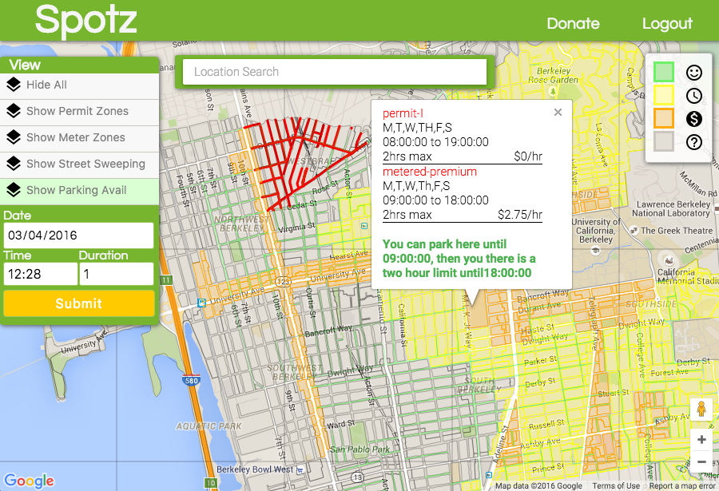
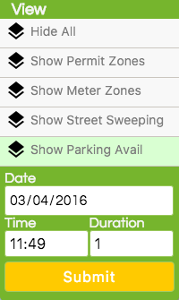
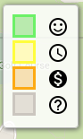
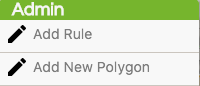
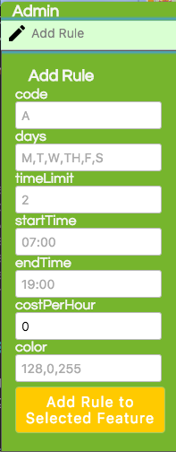
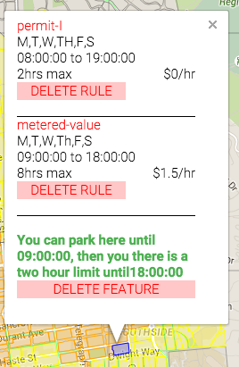

# Spotz

Spotz is an web + mobile app designed to make street parking easier and avoid unnecessary tickets. It does so by displaying parking permit, meter and street sweeping data on a map, allowing a user to quickly identify where to search for a parking spot given time and monetary constraints.  Features on the map are colored based on the parking data so that a user can quickly identify where to search.
  

[Click here to checkout the Spotz app](http://spotz.herokuapp.com/)

<!--## Table of Contents

1. [Usage](#Usage)
1. [Requirements](#requirements)
1. [Development](#development)
1. [Installing Dependencies](#installing-dependencies)
1. [Tasks](#tasks)
1. [Team](#team)
1. [Contributing](#contributing)-->

## Using the App

####Map Navigation
Spotz layers data on top of Google Maps, so a user can navigate around using the standard Google map controls for zooming and scrolling will work.

####Displaying Parking Information
Spotz includes three types of parking data: 

* Parking permit zones
* Metered zones
* Street sweeping routes

Each of the above data layers can be shown individually via the side panel. The Spotz side panel contains controls for showing and hiding different layers of data.  

####Parking Availability Layer
The most useful layer is the Parking Availability layer, which is enabled by default when the app opens.  The Parking Availability layer indicates what parking is available based on the date, time and duration specified.

For the desktop version, there is a legend provided in the top-right corner, to remind the user of the meaning of each color.

The above legend has the following meaning:

* Green - You can park here for the duration specified
* Yellow - There are time restrictions to park
* Orange - There is a cost to park
* Grey - No parking information is availbale
* Red - Street sweeping is occurring, so you should not park there

Every feature on the map is colored one of the above colors based on the date, time and duration specified. The current date and time are set by default when the app opens. 

In side panel, underneath 'Parking Avail', any date, time and duration can be entered (shown above).
 
####Parking Tooltip

Clicking on any of the features will cause a tooltip to be displayed which shows the rules that are applied to that feature.  The information displays the rule's name in red, days it is enforced, time it is enforced, a time limit and an associated cost per hour.  Below the rules, advice is given based on the current time.

## Admin User

Admins help curate the data that is displayed to the standard users.  Admin users have the ability to create/delete rules and features.  A feature is any polygon that is shown on the map. Parking rules can be applied to features.

####Creating An Admin
Go into the database and set the "admin" column for the user to "true".

Once an admin login in, they have access to the following admin menu.

####Add A New Polygon
1. Click the "Add New Polygon" button.
2. Click "enable" button.
3. Click the map on at least 3 points to make the polygon.
4. Save or delete the new polygon with the respective buttons.

####Adding Rules
Add a rule to street sweeping lines or individual permit zone polygons:

1. Click the line or polygon so it is flashing (to indicate it is selected).
2. Click the "Add Rule" button in the sidebar to reveal the Add Rule form.
3. Enter the rule info and click the "add rule to selected feature" button.

####Delete A Feature
1. Click on any feature (polygon or line) currently located on the map
2. Click the 'Delete Feature' button located in the tooltip

####Deleting Rules
1. Click the object to open its tooltip.
2. Click the delete rule for the rule of interest.

## Setting Up A Spotz Server

### Installing Dependencies

Spotz is a MyEAN application, so you need to:

- install <a href="https://nodejs.org/en/">node</a> (version 5.4.1 or higher)
- download the above repo and run "npm install" from the root directory
- create a MySQL database named 'spotz'
- configure a MySQL connection in server/db.js
- import the file spotz-with-two-sided-sweeping-metered.sql to populate the database
- to run an instance locally, environment variables need to set in server/.env
- run `node server/server.js` and the server should be up and running

##Deployed Site
<a href="https://spotz.herokuapp.com">https://spotz.herokuapp.com</a>

## Team

  - __Product Owner__: Adesola Harrison
  - __Scrum Master__: Daniel Kim
  - __Development Team Members__: Raphael Baskerville, Nicolas Bauer, Adesola Harrison, Daniel Kim

## Contributing

See [CONTRIBUTING.md](CONTRIBUTING.md) for contribution guidelines.

## Disclaimer

This app is intended to help users find areas where they can park.  The user is responsible for following all posted signage.  We are not responsible for any costs incurred.